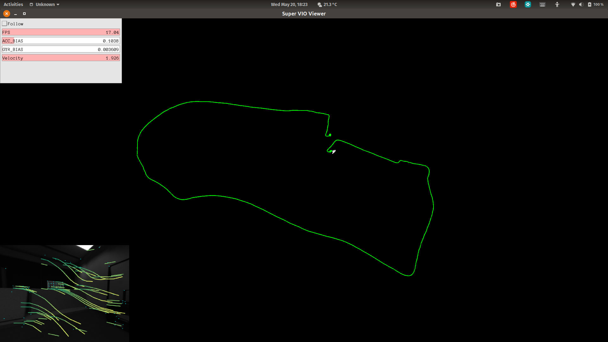

# SuperVIO

*tum outdoor 04 result*

*left: delaunay raw depth; middle: depth map after fast bilateral solver; right: original image*

## implementation schedule

| main module | sub-module | progress |
| ------ | ------ | ------ |
| vision | |  |
| | feature tracking |   |
| | feature extractor |  |
| | feature matcher |   |
| | triangulater|   |
| IMU | | |
| | pre-integration |  |
| | integration |   |
| SFM | |  |
| | initial sfm |  |
| | absolute pose |  |
| | relative pose |  |
|optimization | |  |
| | factors | |
| | reprojection factor|   |
| | imu factor|   |
| | marginalization |  |
| | residual blocks |  |
| | parameters blocks |  |
 | | optimizer |  |
| esitimation | |   |
| | esitimation core |   |
| | state manager |  |
| | align IMU and camera |  |
| dense mapping | |  |
|| densifier |  |
|| fast bilateral solver |  |
| loop closure | |  |
||image retrieval|  |
|| pose graph |  |
||loop closure estimator|  |

## unit tests
| module | test? |
| ------ | ------ |
| vision | 100% |
| camera module | 100& |
| SFM | 100% |
| IMU | 100% |
| optimization | 100% |
| estimation | 100% |
| dense mapping | 100% |
| loop closure | n |

## implementation details:

* 11, 03, 2020
  * finished camera model module: support pinhole, fisheye, omni cameras.
  * 30% triangulation
* 12, 03, 2020
  * 100% triangulation
* 13, 03, 2020
  * add new class "Frame"
  * fix some bugs in camera model and triangulation
  * add unit tests
  * sfm 30%
* 16 - 23, 03, 2020
  * add sub-module: sfm
    * initial sfm
    * relative pose
    * absolute pose
    * sfm optimizer
  * add inverse depth factor
  * add local pose parameterization(for ceres, update Quaternion)
  * find some bug in previous code and fix them
* 24, 03, 2020
  * add base optimizer class
  * finished base optimizer class
  * finished sfm optimizer class
  * add extrinsic parameters in inverse depth factor
* 25, 03, 2020
  * using std::unorder_map for "Track" container,
  * rewrite some code in feature tracking
  * add "compute parallax function" in feature matcher
* 26- 27, 03, 2020
  * previous method in SFM part was referenced from Colmap:
  compute all pairwise score(hf ratio, matched number, parallax between two frame), in my computer homography matrix(fundamental) estimation costs 7ms(Ransac version).
  if we have 10 frames, only this part(without PnP and triangulation) cost 700ms, which is ok for SFM but too too too slow for SLAM.
  * rewrite sfm
  * due to the fact that i decided to use std::map instead of std::vector for "Track" and "Frame", corresponding code in optimizer has also been changed.
* 28, 03, 2020
  * modify some code in base optimizer
  * vio optimizer 50%
  * imu factor 100%
* 29, 03, 2020
  * rewrite imu sub module(can not be directly used in vio optimizer....)
  * vio optimizer 80%
  * add ceres ParameterBlock(make Schur complement more efficient!)
* 30.03.2020
  * add marginalization factor
* 31.03.2020
  * add parameter block(4 class)
  * add residual block(1 class)
* 01 - 02.04.2020
  * add parameter block factory
  * add base, preintegration, reprojection, marginalization residual blocks
  * add residual block factory
  * add marginalizer
  * add optimization helper(20%)
  * remove base, sfm, vio optimizers(previous implementation too ugly)
* 03 - 04. 04.2020
  * using ceres::SizedCostFunction rewrite Factors(reprojection and imu factors), support manual jacobian estimation instead of jacobian estimation by "ceres" using "auto-diff approach"; it's faster than auto-diff cost function and can be used in marginalization
  (auto-diff can not be used in marginalization due to "local pose parameterization");
  * helper 70%
* 06 - 11. 04.2020
  * finished helper
  * almost finished estimation and state manager(main thread of slam/vio);
* 13.04.2020
  * finished estimator
* 14.04.2020
  * finished visual imu alignment
  * finished estimation core
* 16.04.2020
  * bug1: the last element in a "std::map", is "std::map::rbegin()"" not "rend()".....stupid mistake.
  * bug2: forget to set loss function in reprojection residual blocks;
  * bug3: residual should be "prediction - measurement"
* 17.04.2020
  * bug4: sqrt information bug in inverse_depth_factor
* 18.04.2020  
  * bug5: cv::recoverpose output a transform(frame1 ==> frame2)T_C2_C1, so in the relative pose, should inverse the output of relative_pose
  * bug6: small bug in converting "position, rotation" to "Pose3"(Eigen::Isometry3d).
* 20.04.2020
  * bug7: EigenBase::DeltaQ: output quaternion should be normalized;
  * bug8: mid point pre-integration bug
* 22.04.2020
  * bug9: imu factor
  * bug10: imu preintegrator: state_order
  * bug11: pre_integration, assert bug
  * problem: gauge ambiguity? set fixed?
* 23 - 25.04.2020
  * bug12: Helper::GetSpeedBiasFromParameterBlock, wrong pointer position for gyroscope bias and acceleration bias.(mistake)
  * bug13: everytimes using ceres optimization, should creat a new local_parameterization!!!
  * bug14: ceres cost function can not be resued!!!!(it took me two days to solve this bug)
  * bug15: update residual bug in marginalization_factor
  * add multi-threads support in marginalization
* 27.04.2020
  * bug16: two small bugs in VisualIMUAlignment
* 28 - 29.04.2020
  * try another method that can estimate imu accelerator bias(reference paper<<Online Initialization and Automatic Camera-IMU Extrinsic Calibration for Monocular Visual-Inertial SLAM>>), but due to high coupling between accelerator bias and gravity vector, accuracy has not been improved significantly. Consider still using the method that vins provides.
  * merge some similar functions in estimation_core, so that the code is cleaner and easy to read.
  * add ros interface for loading control parameters
* 30.04 - 01.05
  * implement visualizer
  * test visualizer
* 02.05.2020 - 03.05.2020
  * fix a lot of bugs but still some small bugs; but at least vio is RUNNING!
* 04.05.2020
  * i am such an idiot, i only read the extrinsic parameters between imu and camera, but forget to set it!
  * super vio is RUNNING successfully!!!!!!!
* 06.05.2020
  * fixed the bug of "after marginalize second new frame, system crash"
  * fixed a bug in jacobian estimation (projection factor)
* 11 - 12.05.2020
  * add detailed dense mapping and loop closure framework
* 17.05.2020
  * add pose graph and relative pose factor
* 18.05.2020
  * add bag of words for image retrieval
* 3.06.2020
  * finished fast bilateral solver
  * finished densifier
  (using delaunay for interpolation and fbs for refine depth map)
* 04.06.2020
  * fix a lot bugs in dense mapping
* 10.06.2020
  * add mesh regularizer and point cloud down sampler

## next step(@todo):
* test densifier
* training bag of words vocabulary
