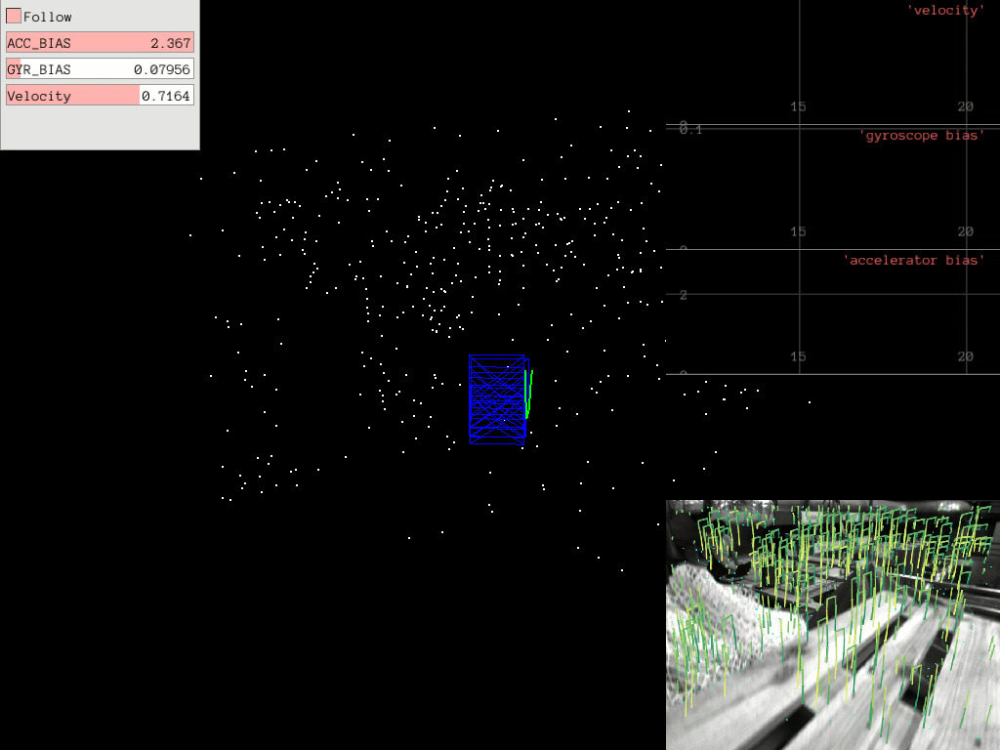

# SuperVIO

## visual initial odometry using SuperPoint as Frontend.
### indoor

### tum outdoor 04


### step 1:
dependencies： libtorch 1.1.0, opencv 3.4.1 with contrib and enable cuda, ceres 2.0.0(from github), Pangolin, Dbow3

tips for compile libtorch
```
git clone --recursive -b v1.1.0 https://github.com/pytorch/pytorch
cd pytorch && mkdir build && cd build
python ../tools/build_libtorch.py
export LD_LIBRARY_PATH="YOUR_TORCH_PATH"
```
and change Torch_dir in CMakeLists.txt

### step 2:
run(tum visual-initial dataset)
```
roslaunch supervio super_vio_node_tum_512.launch
```
or (euroc dataset)
```
roslaunch supervio super_vio_node.launch
```

### step 3:
play rosbag

enjoy!

### @todo:
1. loop fusion
2. dense mapping
